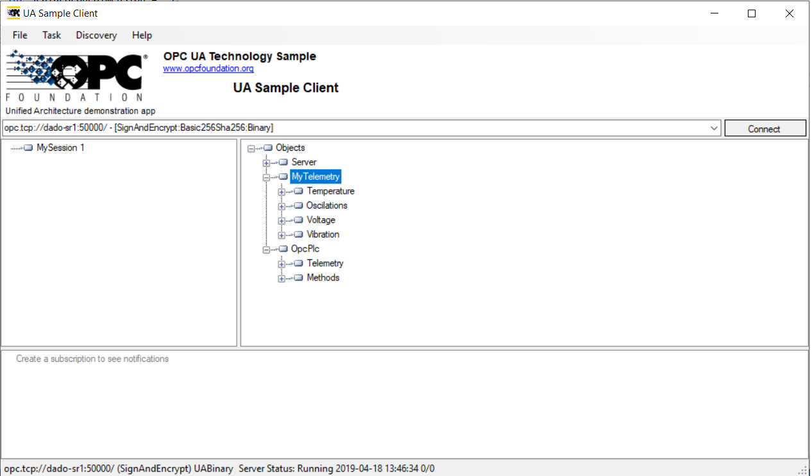

# OPC PLC server
Implements an OPC UA server with different nodes which generate random data and anomalies.

## Features
The following nodes are part of the PLC simulation:
- with alternating boolean
- random signed 32-bit integer
- random unsigend 32-bit integer
- a sine wave with a spike anomaly
- a sine wave with a dip anomaly
- a value showing a positive trend
- a value showing a negative trend

By default everything is enabled, please use command line options to disable certain anomaly or data generation features.
Additionally to simulation nodes a JSON configuration file allows nodes to be created as configured.

Following picure shows OPCUA Client connected to OPCPLC running on port 50000. The nodes in the folder *MyTelemetry* are configured via a JSON configuraton file. None of values of those nodes is simulated.

## Getting Started

### Prerequisites

The implementation is based on .NET Core so it is cross-platform and recommended hosting environment is docker.

### Installation

There is no installation required.

### Quickstart

A docker container of the component is hosted in the Microsoft Container Registry and can be pulled by:

docker pull mcr.microsoft.com/iotedge/opc-plc

The tags of the container match the tags of this repository and the containers are available for Windows amd64, Linux amd64 and Linux ARM32. 

## Demo

The [OpcClient](https://github.com/Azure-Samples/iot-edge-opc-client) is an OPC UA client, which can be used to work with this OPC UA server implementation.

Please check out the github repository https://github.com/Azure-Samples/iot-edge-industrial-configs for sample configurations showing usage of this OPC UA server implementation.

## Notes

X.509 certificates releated:

* Running on Windows natively, you can not use an application certificate store of type `Directory`, since the access to the private key fails. Please use the option `--at X509Store` in this case.
* Running as Linux docker container, you can map the certificate stores to the host file system by using the docker run option `-v <hostdirectory>:/appdata`. This will make the certificate persistent over starts.
* Running as Linux docker container and want to use an X509Store for the application certificate, you need to use the docker run option `-v x509certstores:/root/.dotnet/corefx/cryptography/x509stores` and the application option `--at X509Store`

## User node configuration via JSON configuration file
If the module (application) is started with argument **--nodesfile** then the specified JSON configuration file is loaded.
Nodes defined in JSON file will be published by the server. This enables another OPC UA client application to set the state/value of the node. Please note that nodes specified in JSON file are NOT a part of simulation. They remain visible in unchanged state as long some OPC UA client application changes their status.
Following command shows how to start the module (application):
~~~
dotnet opcplc.dll --at X509Store --nodesfile nodesfile.json
~~~
Configuration file looks as described below:
~~~
{
  "Folder": "MyTelemetry",
  "NodeList": {
   [
      {
        "NodeId": 1023,
        "Name": "ActualSpeed",
        "Description": "Rotational speed"
      },
      {
        "NodeId": "aRMS",
      },
      {
        "NodeId": "1025",
        "Name": "DKW",
        "DataType": "Float",
        "ValueRank": -1,
        "AccessLevel": "CurrentReadOrWrite",
        "Description": "Diagnostic characteristic value"
      }
    ]
  }
}
~~~
*Folder* defines the name of the folder under which the user specified nodes should be created. This folder is created below the root of the OPC UA server.
*NodeList* defines the list of nodes, which will be published by emulated server. Nodes specified in the list can be browsed and changed by OPC-UA applications. This enables developers to easy implement and test OPC-UA client applications.
*NodeId*: Specifies the identifier of the node and must be specified. This value can be a decimal or string value. Every other JSON type is converted to a string identifier.
*Name*: The display name of the tag. If not set it will be set to the NodeId. (Optional)
*DataType*: The OPC UA valid type. It specifies one of types defined by BuiltInType. If an invalid type is specified or if it is ommitted it defaults to 'Int32'. (Optional)
*ValueRank*: As defined by type ValueRanks. If omitted it will be set to the value '-1' (Scalar). (Optional)
*AccessLevel*: Specifies one of access levels defined by type AccessLevels. If an invalid access level is specified or if it is omitted it defaults to 'CurrentReadOrWrite'. (Optional)
*Description*: Description of the node.  If not set it will be set to the NodeId. (Optional)

## Resources

- [The OPC Foundation OPC UA .NET reference stack](https://github.com/OPCFoundation/UA-.NETStandard)
